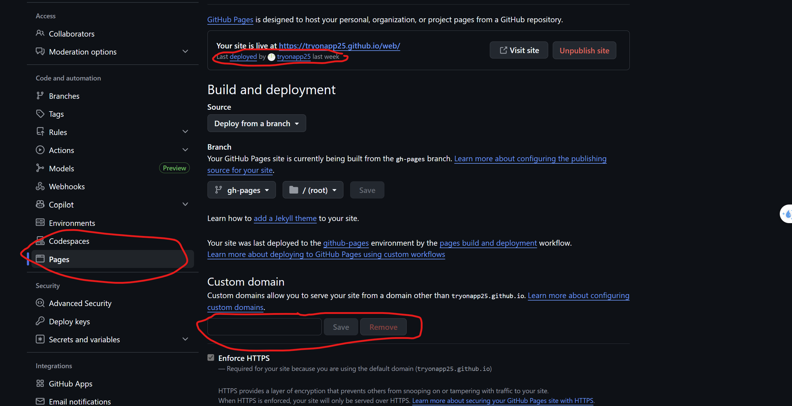

# DNS A record settings:
| Type | Name | Value           |
| ---- | ---- | --------------- |
| A    | @    | 185.199.108.153 |
| A    | @    | 185.199.109.153 |
| A    | @    | 185.199.110.153 |
| A    | @    | 185.199.111.153 |

# push code 
1. git add .
2. git commit -m""
3. git push origin main

# Deploy web
1. npm run build
2. npm run deploy

# In gitHub
1. Go to Settings - Pages
2. Insert domain name into Custom domain.
3. Make sure Enforce HTTPS is enable.

